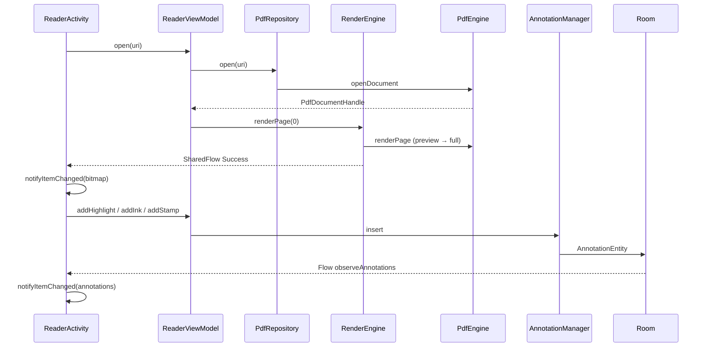

# PDF 工坊（PDF Studio）

Android 原生 PDF 阅读与编辑应用。基于 **Pdfium** 做高速渲染与阅读，基于 **PDFBox-Android** 做文本提取、页面结构修改与标注导出。采用多模块分层架构，支持 SAF 打开本地文件、Room 持久化标注与最近文件记录。

| 属性 | 值 |
|------|-----|
| 应用名 | PDF 工坊 |
| 包名 | `com.pdfstudio.app` |
| minSdk | 24 |
| targetSdk / compileSdk | 34 |
| JDK | 17 |

---

## 功能需求

### 阅读

| 能力 | 说明 |
|------|------|
| 打开 PDF | 通过 SAF（Storage Access Framework）选择本地 PDF，并尝试持久化 URI 读权限 |
| 最近文件 | Room 记录最近打开的 50 个文件，首页列表一键重新打开 |
| 垂直分页 | RecyclerView + LinearLayoutManager 纵向连续翻页，按屏宽等比缩放 |
| 页码指示 | 底部实时显示「第 N / M 页」 |
| 密码 PDF | 打开失败时弹出密码输入框，支持加密文档 |
| 书签目录 | 读取 PDF 大纲（Outline），点击跳转到对应页 |
| 文字搜索 | 逐页全文匹配，展示页码与摘要，点击定位 |

### 标注与编辑

| 能力 | 说明 |
|------|------|
| 高亮 | 框选区域，半透明黄色矩形标注 |
| 下划线 | 框选区域，底部橙色下划线标注 |
| 手绘（Ink） | 自由曲线，归一化坐标存储 |
| 便签（FreeText） | 点击页面输入文字，显示在指定位置 |
| 手写签名（Stamp） | 独立签名板生成 PNG，嵌入当前页底部 |
| 撤销 | 内存撤销栈（最多 50 步），删除最近一条标注 |
| 编辑工具栏 | 底部工具栏切换模式，当前模式有高亮选中态 |
| 多页编辑 | 屏幕上所有可见页均可操作，不限于正中页 |
| 另存为 | 将 Room 中的标注合并写入新 PDF 文件（SAF 选择输出路径） |

> 标注默认保存在 Room 数据库，与原始 PDF 分离；用户主动「另存为」时才写入 PDF 文件。

### 页面操作

| 能力 | 说明 |
|------|------|
| 旋转 | 当前页旋转 90° / 180°（PDFBox 写回源文件） |
| 删除 | 删除当前页 |
| 合并 | 多选 PDF 合并为一个新文件 |
| 拆分 | 按页码范围拆出子文档 |

### 性能与体验

| 能力 | 说明 |
|------|------|
| 渐进渲染 | 先出半分辨率预览，再补全分辨率 |
| 缩放 | 双指捏合缩放（50%–400%），工具栏放大/缩小/重置；放大后可单指横向平移 |
| 滚动优化 | 滑动中暂停渲染请求，停稳后渲染焦点页并预加载邻页 |
| 内存缓存 | LruCache 按字节计容量，低内存设备降级 RGB_565 |
| 局部刷新 | 渲染完成 / 标注变更仅刷新对应 RecyclerView Item |
| 触摸分流 | 编辑时垂直滑动交给列表滚动，水平/短手势用于绘制 |

---

## 技术架构

### 整体分层

```
┌─────────────────────────────────────────────────────────┐
│  app（Application、MainActivity、SAF 路由）              │
├─────────────────────────────────────────────────────────┤
│  feature/                                               │
│    filelist  reader  editor  pageops                    │
├─────────────────────────────────────────────────────────┤
│  core/                                                  │
│    common  pdf-engine  pdf-render  pdf-annot  storage   │
├─────────────────────────────────────────────────────────┤
│  第三方引擎                                              │
│    pdfium-android（读/渲）  pdfbox-android（写/文本）    │
└─────────────────────────────────────────────────────────┘
```

### 双引擎策略

| 引擎 | 职责 | 使用场景 |
|------|------|----------|
| **Pdfium** | 打开文档、单页渲染 Bitmap、读取书签、页尺寸 | 阅读器实时渲染 |
| **PDFBox** | 文本提取/搜索、旋转/删页/合并/拆分、标注导出 | 结构修改、另存为 |

读写分离可避免在 UI 线程做重型 PDF 写入，同时保持渲染路径轻量。

### 应用内数据流（阅读 + 标注）



### 技术栈

- **语言 / 运行时**：Kotlin、Coroutines
- **架构模式**：MVVM + 多模块 Clean-ish 分层
- **依赖注入**：Hilt（`@HiltAndroidApp`、`@AndroidEntryPoint`、`@HiltViewModel`）
- **UI**：ViewBinding、Material 3、RecyclerView
- **本地存储**：Room（最近文件 + 标注）
- **异步**：StateFlow / SharedFlow、`DispatcherProvider` 抽象 IO 调度

### 模块依赖关系

```
app
 ├── feature:filelist ──► core:storage ──► core:common
 ├── feature:reader ────► core:pdf-engine, pdf-render, pdf-annot, storage
 │                     ├► feature:editor ──► core:pdf-annot
 │                     └► feature:pageops
 └── (传递) core:common

core:pdf-render ──► core:pdf-engine ──► pdfium-android
core:pdf-annot ───► core:storage, core:pdf-engine ──► pdfbox-android
```

---

## 模块实现细节

### `app` — 应用壳与导航

**职责**：Application 入口、首页容器、SAF 文件选择与 Activity 跳转。

| 类 | 说明 |
|----|------|
| `PdfStudioApp` | `@HiltAndroidApp`，Hilt 根组件 |
| `MainActivity` | 宿主 `FileListFragment`，实现 SAF `OpenDocument` 与 `ReaderActivity` 跳转 |

**技术点**：
- 使用 `FragmentTransaction.replace()` 加载首页，未接入 Navigation Graph
- `takePersistableUriPermission()` 尝试持久化 URI（失败静默忽略）
- `ReaderActivity`、`SignaturePadActivity` 跨模块在 Manifest 显式注册

---

### `core/common` — 公共基础

**职责**：跨模块共享类型，无 Android UI 依赖。

| 类 | 说明 |
|----|------|
| `AppResult<T>` | `Success` / `Error` 密封类，统一错误传播 |
| `DispatcherProvider` | 封装 `Main` / `IO` / `Default` 调度器，便于单测替换 |

---

### `core/pdf-engine` — PDF 文档引擎

**职责**：Pdfium 封装、文档生命周期、PDFBox 页面操作与文字服务。

| 类 | 说明 |
|----|------|
| `PdfEngine` | Pdfium 单例：打开/关闭、渲染 Bitmap、页尺寸、书签、密码检测 |
| `PdfRepository` | 持有当前打开的 `PdfDocumentHandle`（同时仅一份） |
| `PageOperationService` | PDFBox：旋转、删页、合并、拆分、另存副本 |
| `PdfTextService` | PDFBox：逐页 `extractPageText` / `searchText` |
| `PdfDocumentHandle` | 文档句柄（uri、PdfiumCore、PdfDocument、pageCount） |

**技术点**：
- `renderPage(handle, pageIndex, targetWidth)` 按目标宽度等比渲染
- `getPageDisplayHeight()` 预计算每页在 RecyclerView 中的占位高度，避免 `wrap_content` 高度为 0
- 页面操作通过 `ContentResolver.openOutputStream(uri, "wt")` 写回源 URI
- 密码保护：错误信息含 `"password"` 时 UI 弹出密码框

---

### `core/pdf-render` — 渲染调度与缓存

**职责**：后台异步渲染、LruCache、渐进式预览、邻页预加载。

| 类 | 说明 |
|----|------|
| `RenderEngine` | `@Singleton`，渲染队列与缓存管理 |
| `PageRenderKey` | 缓存键 `(pageIndex, widthBucket)` |
| `RenderState` | `Idle` / `Loading` / `Success` / `Error` |

**渐进渲染流程**：

1. 查全分辨率缓存 → 命中则立即通知 UI
2. 未命中 → 先渲染 **半宽预览**（`max(targetWidth/2, 360)`）
3. 再渲染 **全分辨率** Bitmap
4. 焦点页完成后 **预加载** `page ± 1`
5. 通过 `SharedFlow<RenderState>` 通知 UI 刷新

**技术点**：
- `LruCache` 上限 = `maxMemory / 8`（至少 4MB），`sizeOf` 按 `bitmap.byteCount` 计
- `renderMutex` 串行化 Pdfium 调用（native 非线程安全）
- `focalJob` 管理焦点页任务；新焦点页取消旧焦点任务，预加载任务独立不互相取消
- 低内存设备：`setLowMemoryMode(true)` → `RGB_565` 替代 `ARGB_8888`
- `getCached()` 支持全分辨率未命中时回退预览图
- 文档变更 / ViewModel 销毁时 `evictCache()` + `cancelPending()`

---

### `core/pdf-annot` — 标注领域与导出

**职责**：标注模型、Room 持久化、撤销栈、坐标映射、PDF 导出。

| 类 | 说明 |
|----|------|
| `PdfAnnotation` | 领域模型，`toPayload()` / `fromEntity()` JSON 序列化 |
| `AnnotationType` | HIGHLIGHT、UNDERLINE、STRIKETHROUGH、INK、FREE_TEXT、STAMP |
| `AnnotationManager` | CRUD、`observeAnnotations` Flow、撤销 |
| `CoordinateMapper` | 设备坐标 ↔ 页面归一化坐标 (0..1) |
| `UndoStack` | 最多 50 步 `Added` / `Removed` |
| `PdfAnnotationExporter` | 将 Room 标注写入 PDFBox 并另存 |

**坐标策略**：
- 存储使用 **归一化页面坐标**（0..1），与设备分辨率、缩放无关
- 绘制时 `normalizedRectToDevice()` 映射到 Overlay 像素坐标
- 导出时按 `mediaBox` 转 PDF 坐标系（Y 轴翻转）

**导出映射**：

| 标注类型 | PDFBox 实现 |
|----------|-------------|
| 高亮 / 下划线 / 删除线 | `PDAnnotationTextMarkup` |
| 便签 | `PDAnnotationText` |
| 手绘 | `PDPageContentStream` 描边路径 |
| 签名 | Base64 PNG → JPEG 嵌入 `drawImage` |

---

### `core/storage` — Room 持久化

**职责**：最近文件与标注的本地存储。

**数据库**：`PdfDatabase`（`pdf_reader.db`，version 1）

| 表 | 实体 | 要点 |
|----|------|------|
| `recent_files` | `RecentFileEntity` | PK = `uri`，含 `displayName`、`pageCount`、`lastOpenedAt` |
| `annotations` | `AnnotationEntity` | 自增 PK，`documentUri` + `pageIndex` + `type` + `color` + `payload`(JSON) |

| DAO / Repository | 说明 |
|------------------|------|
| `RecentFileDao` | `observeRecentFiles()`（最近 50 条）、`upsert` |
| `AnnotationDao` | `observeAnnotations`、`getForPage`、`insert`、`deleteById` |
| `RecentFileRepository` | `recordOpen()`、`remove()` |

---

### `feature/filelist` — 首页文件列表

**职责**：最近文件展示与「打开 PDF」入口。

| 类 | 说明 |
|----|------|
| `FileListFragment` | RecyclerView 列表 + 空态 |
| `FileListViewModel` | `recentFiles: StateFlow`，`SharingStarted.WhileSubscribed(5000)` |
| `RecentFileAdapter` | `ListAdapter` + DiffUtil |

**技术点**：通过 `Callback` 接口将 SAF 与导航委托给 `MainActivity`，Fragment 不直接依赖 app 模块。

---

### `feature/reader` — 阅读器（核心编排层）

**职责**：聚合所有 core 服务，实现阅读、编辑、搜索、保存的完整用户流程。

| 类 | 说明 |
|----|------|
| `ReaderActivity` | 垂直 RecyclerView 分页 + 工具栏 + Options 菜单 |
| `ReaderViewModel` | 文档状态、渲染请求、标注 CRUD、页面操作、搜索、另存为 |
| `PdfPageAdapter` | 每页 `ImageView`（PDF 底图）+ `AnnotationOverlayView`（标注层） |
| `ReaderUiState` | 加载态、页数、当前页、编辑模式、书签、搜索结果、页高列表 |

**滚动与渲染策略**：

```
onScrolled        → 仅更新页码指示 + 可见页可编辑范围
SCROLL_STATE_IDLE → renderFocalAndPreload()
                    ├─ requestRender(焦点页)   // 渐进渲染
                    ├─ preloadPage(其余可见页)
                    └─ 刷新已有缓存的 Item
```

**编辑模式**：
- `editableRange`：屏幕上 `firstVisible..lastVisible` 所有页启用 Overlay 触摸
- Payload 局部刷新：`PAYLOAD_EDIT_MODE` / `PAYLOAD_ANNOTATIONS` / `PAYLOAD_BITMAP`
- 菜单：编辑/阅读切换、另存为、搜索、书签、页面操作、合并/拆分

**技术点**：
- `setItemViewCacheSize(4)` 提升翻页流畅度
- 页面结构变更后 `evictCache()` + `reopen(uri)` 保证渲染与页数一致
- 签名完成后 Toast 提示「签名已添加到第 N 页底部」

---

### `feature/editor` — 标注交互 UI

**职责**：编辑工具栏与触摸绘制层（无独立 ViewModel，由 Reader 编排）。

| 类 | 说明 |
|----|------|
| `EditorMode` | READ / HIGHLIGHT / UNDERLINE / INK / NOTE / STAMP |
| `EditorToolbarView` | Material 按钮组，`setSelectedMode()` 提供选中态视觉反馈 |
| `AnnotationOverlayView` | 触摸绘制：框选、手绘、便签点击、渲染已有标注 |
| `SignaturePadView` | 手写签名画布 |
| `SignaturePadActivity` | 签名 → PNG Base64 → `EXTRA_SIGNATURE_BASE64` |

**触摸分流（`AnnotationOverlayView`）**：

| 手势 | 行为 |
|------|------|
| 垂直滑动（`dy > dx × 1.2`） | 不拦截，交给 RecyclerView 滚动 |
| 水平 / 短手势 | `requestDisallowInterceptTouchEvent(true)`，进入绘制 |
| 高亮模式 | 半透明黄色矩形预览 |
| 下划线模式 | 橙色底边线预览（与保存类型一致） |
| 手绘模式 | 设备坐标实时预览 → 归一化坐标落库 |
| 签名模式 | 启动 `SignaturePadActivity`，Overlay 不处理触摸 |

**技术点**：
- 绘制期间启用 `LAYER_TYPE_HARDWARE` 降低重绘开销
- 本地草稿（`inkStrokes`、`pendingSelection`）在 DB 回写前保持可见
- STAMP 渲染：Base64 解码为 Bitmap 绘制到归一化矩形区域

---

### `feature/pageops` — 页面操作对话框

**职责**：纯 UI 入口，无 ViewModel / Hilt。

| 类 | 说明 |
|----|------|
| `PageOpsDialogFragment` | AlertDialog 列表菜单 |
| `Callback` | `onRotatePage` / `onDeletePage` / `onMergePdfs` / `onSplitPdf` |

业务逻辑全部由 `ReaderActivity` 实现并委托 `ReaderViewModel` → `PageOperationService`。

---

## 构建与安装

### 手动编译

```bash
cd pdf-studio
./gradlew :app:assembleDebug
```

产物：`app/build/outputs/apk/debug/app-debug.apk`

### 一键编译 + 安装（推荐）

```bash
./build-and-install.sh
```

脚本行为：

1. 对 `app/`、`core/`、`feature/` 业务源码计算 SHA-256 指纹（排除 `build/`）
2. 与 `.build-and-install.stamp` 对比：有变更或 APK 不存在 → 重新编译，否则跳过
3. `adb install -r` 安装到第一个 USB 真机（排除模拟器）
4. 冒烟测试：启动 App → 等待 4s → 检测 logcat 中 `FATAL EXCEPTION`

环境要求：**JDK 17**、**Android SDK 34**、USB 调试已开启。

---

## 项目结构

```
pdf-studio/
├── app/                          # Application、MainActivity
├── core/
│   ├── common/                   # AppResult、DispatcherProvider
│   ├── pdf-engine/               # Pdfium + PDFBox 封装
│   ├── pdf-render/               # RenderEngine、LruCache
│   ├── pdf-annot/                # 标注模型、导出、坐标映射
│   └── storage/                  # Room 数据库
├── feature/
│   ├── filelist/                 # 首页最近文件
│   ├── reader/                   # 阅读器 Activity + ViewModel
│   ├── editor/                   # 工具栏、Overlay、签名板
│   └── pageops/                  # 页面操作对话框
├── build-and-install.sh          # 智能编译安装脚本
└── gradle/libs.versions.toml     # 依赖版本管理
```

---

## 已知限制与后续方向

| 项 | 现状 |
|----|------|
| 缩放 | 支持 50%–400%，放大后横向平移；编辑模式下暂不支持捏合缩放 |
| 标注写回原文件 | 仅支持「另存为」新文件 |
| 删除线模式 | 数据模型支持，工具栏未暴露入口 |
| Navigation Component | 依赖已引入，尚未接入 Graph |

---

## License

本项目使用的第三方库遵循各自开源协议（Pdfium、PDFBox-Android 等）。应用业务代码供学习与面试项目参考。

---

## CI 试跑

`feat/ci-test`：验证 PR → CodeRabbit + CI → Merge → Release 钉钉通知链路。
