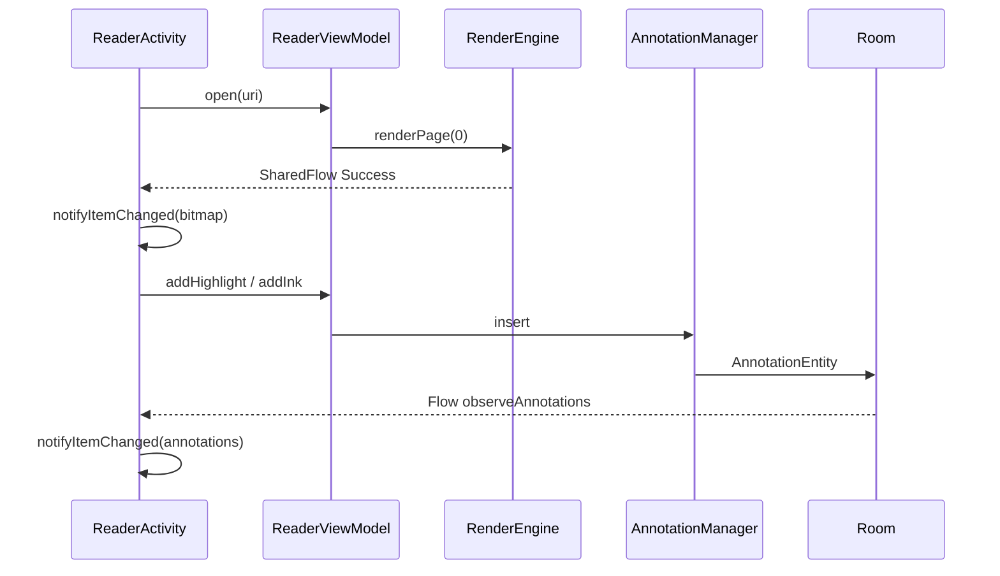

# PDF助手（PDF Studio）

Android 原生 PDF 阅读与编辑应用。基于 **Pdfium** 做高速渲染，基于 **PDFBox-Android** 做文本提取、页面结构修改与标注导出。多模块分层架构，支持 SAF 打开本地文件、Room 持久化标注与最近文件记录。

| 属性 | 值 |
|------|-----|
| 应用名 | PDF助手 |
| 包名 | `com.pdfstudio.app` |
| minSdk | 24 |
| targetSdk / compileSdk | 34 |
| JDK | 17 |

---

## 功能一览

### 阅读

| 能力 | 说明 |
|------|------|
| 打开 PDF | SAF 选择本地文件，并尝试持久化 URI 读权限 |
| 最近文件 | Room 记录最近 50 个文件，首页一键重新打开 |
| 垂直分页 | RecyclerView 纵向连续翻页，按屏宽等比缩放 |
| 页码指示 | 底部显示「第 N / M 页 · 缩放%」 |
| 密码 PDF | 打开失败时弹出密码框重试 |
| 书签目录 | 读取 PDF 大纲，点击跳转对应页 |
| 文字搜索 | 逐页全文匹配，展示页码与摘要，点击定位 |

### 标注与编辑

| 能力 | 说明 |
|------|------|
| 高亮 | 任意方向框选，半透明黄色矩形 |
| 下划线 | 任意方向框选，保存为选区底边橙色横线 |
| 手绘（Ink） | 任意方向自由曲线，归一化坐标存储 |
| 便签（FreeText） | 点击页面输入文字 |
| 手写签名（Stamp） | 签名板生成 PNG，嵌入当前页底部区域 |
| 撤销 | 内存撤销栈（最多 50 步） |
| 多页编辑 | 屏幕上所有可见页均可操作（`editableRange`） |
| 另存为 | 将 Room 标注合并写入新 PDF（SAF 选输出路径） |

> 标注默认保存在 Room，与原始 PDF 分离；用户主动「另存为」时才写入 PDF 文件。

### 页面操作

通过菜单 **页面操作** 打开对话框：

| 能力 | 说明 |
|------|------|
| 旋转 | 当前页 90° / 180°（PDFBox 写回源文件） |
| 删除 | 删除当前页 |
| 合并 | 多选 PDF 合并为一个新文件 |
| 拆分 | 按页码范围拆出子文档 |

---

## 交互与性能

### 阅读 / 滚动 / 缩放

| 场景 | 行为 |
|------|------|
| **阅读模式** | 单指垂直滑动翻页；双指捏合缩放（50%–400%） |
| **放大后平移** | `ZoomablePageContainer` 支持单指横向平移（仅阅读模式或未在编辑的页面） |
| **编辑模式翻页** | 单指用于标注，不触发列表滚动；需切回**阅读模式**（菜单「阅读/编辑」）再翻页 |
| **编辑模式缩放** | 双指捏合缩放仍可用，缩放会更新渲染宽度并可能清空位图缓存重渲 |

### 标注触摸（`AnnotationOverlayView`）

所有绘制模式在 `ACTION_DOWN` 时立即落笔，并向父级链 `requestDisallowInterceptTouchEvent(true)`，支持**横 / 竖 / 斜**任意方向：

| 模式 | 触摸行为 |
|------|----------|
| 高亮 | 按下即开始框选，实时矩形预览 → 归一化坐标落库 |
| 下划线 | 同上，预览为底边横线 |
| 手绘 | 按下即开始笔迹，实时路径预览 |
| 便签 | 单击弹出输入框 |
| 签名 | 启动 `SignaturePadActivity`，Overlay 不处理触摸 |

编辑模式下 `ZoomablePageContainer.panEnabled = false`，避免横向平移与框选/手绘冲突。

### 渲染策略

```
onScrolled（滚动中）  → 更新页码、editableRange；暂停部分页高计算
SCROLL_STATE_IDLE     → renderFocalAndPreload()
                        ├─ 焦点页渐进渲染（半宽预览 → 全分辨率）
                        ├─ 阅读模式：预加载可见邻页
                        └─ 编辑模式：仅缺位图时渲染焦点页，跳过邻页预加载
```

| 优化点 | 说明 |
|--------|------|
| 渐进渲染 | 先 `max(targetWidth/2, 360)` 预览，再补全分辨率 |
| 位图缓存 | LruCache 按字节计容量（`maxMemory/8`，至少 4MB） |
| 低内存 | 低内存设备或大文档（>80 页）降级 `RGB_565` |
| 大文档 | 懒加载页高、限制邻页预加载 |
| 局部刷新 | Payload 刷新 bitmap / annotations / edit_mode / zoom |
| 绘制性能 | `postInvalidateOnAnimation`、复用 `Path`、Stamp Bitmap 缓存 |

---

## 技术架构

### 分层结构

```
┌─────────────────────────────────────────────────────────┐
│  app（Application、MainActivity、SAF 路由）              │
├─────────────────────────────────────────────────────────┤
│  feature/                                               │
│    filelist  reader  editor  pageops                    │
├─────────────────────────────────────────────────────────┤
│  core/                                                  │
│    common  pdf-engine  pdf-render  pdf-annot  storage   │
├─────────────────────────────────────────────────────────┤
│  第三方引擎                                              │
│    pdfium-android（读/渲）  pdfbox-android（写/文本）    │
└─────────────────────────────────────────────────────────┘
```

### 双引擎策略

| 引擎 | 职责 |
|------|------|
| **Pdfium** | 打开文档、渲染 Bitmap、书签、页尺寸 |
| **PDFBox** | 文本搜索、旋转/删页/合并/拆分、标注导出 |

### 模块依赖

```
app
 ├── feature:filelist ──► core:storage ──► core:common
 ├── feature:reader ────► core:pdf-engine, pdf-render, pdf-annot, storage
 │                     ├► feature:editor ──► core:pdf-annot
 │                     └► feature:pageops
 └── (传递) core:common

core:pdf-render ──► core:pdf-engine ──► pdfium-android
core:pdf-annot  ──► core:storage, core:pdf-engine ──► pdfbox-android
```

### 核心数据流



### 技术栈

- Kotlin、Coroutines、MVVM
- Hilt（`@HiltAndroidApp`、`@AndroidEntryPoint`、`@HiltViewModel`）
- ViewBinding、Material 3、RecyclerView
- Room（最近文件 + 标注）
- StateFlow / SharedFlow、`DispatcherProvider` 抽象 IO 调度

---

## 模块说明

| 模块 | 职责 | 关键类 |
|------|------|--------|
| `app` | 应用壳、SAF 路由 | `PdfStudioApp`、`MainActivity` |
| `core/common` | 公共类型与工具 | `AppResult`、`DispatcherProvider`、`UriDisplayNameResolver` |
| `core/pdf-engine` | Pdfium + PDFBox 封装 | `PdfEngine`、`PdfRepository`、`PageOperationService`、`PdfTextService` |
| `core/pdf-render` | 渲染调度与缓存 | `RenderEngine`、`PageRenderKey`、`RenderState` |
| `core/pdf-annot` | 标注领域与导出 | `PdfAnnotation`、`AnnotationManager`、`CoordinateMapper`、`PdfAnnotationExporter`、`UndoStack` |
| `core/storage` | Room 持久化 | `PdfDatabase`、`RecentFileDao`、`AnnotationDao` |
| `feature/filelist` | 首页最近文件 | `FileListFragment`、`FileListViewModel` |
| `feature/reader` | 阅读器编排层 | `ReaderActivity`、`ReaderViewModel`、`PdfPageAdapter`、`ZoomablePageContainer` |
| `feature/editor` | 标注交互 UI | `EditorToolbarView`、`AnnotationOverlayView`、`SignaturePadActivity` |
| `feature/pageops` | 页面操作入口 | `PageOpsDialogFragment` |

**坐标策略**：标注以页面归一化坐标（0..1）存储，与设备分辨率、缩放无关；绘制时映射到 Overlay 像素，导出时按 PDF `mediaBox` 转换。

**数据库**（`pdf_reader.db`）：

| 表 | 说明 |
|----|------|
| `recent_files` | PK = `uri`，含 `displayName`、`pageCount`、`lastOpenedAt` |
| `annotations` | 自增 PK，`documentUri` + `pageIndex` + `type` + `color` + `payload`(JSON) |

---

## 项目结构

```
pdf-studio/
├── app/                    # Application、MainActivity
├── core/
│   ├── common/
│   ├── pdf-engine/
│   ├── pdf-render/
│   ├── pdf-annot/
│   └── storage/
├── feature/
│   ├── filelist/
│   ├── reader/
│   ├── editor/
│   └── pageops/
├── .github/workflows/      # PR CI、Release 通知
├── build-and-install.sh    # 智能编译安装脚本
├── signing/                 # 本地 keystore（通用脚本见 ~/tools/scripts/）
└── gradle/libs.versions.toml
```

---

## 构建与安装

### 手动编译

```bash
cd pdf-studio
./gradlew :app:assembleDebug
```

产物：`app/build/outputs/apk/debug/app-debug.apk`

### 一键编译 + 安装（推荐）

```bash
./build-and-install.sh
```

脚本行为：

1. 对 `app/`、`core/`、`feature/` 业务源码计算 SHA-256 指纹
2. 与 `.build-and-install.stamp` 对比：有变更或 APK 不存在 → 重新编译
3. `adb install -r` 安装到第一个 USB 真机（排除模拟器）
4. 冒烟测试：启动 App → 检测 logcat 中 `FATAL EXCEPTION`

环境要求：**JDK 17**、**Android SDK 34**、USB 调试已开启。

### Release 分发（蒲公英 + 钉钉）

push 到 `main` 后自动：编译 Release APK → 上传 GitHub Release → 上传[蒲公英](https://www.pgyer.com) → 钉钉通知。

| Secret | 说明 |
|--------|------|
| `PGYER_API_KEY` | 蒲公英后台 [API 信息](https://www.pgyer.com/account/api) 中的 API Key |
| `DINGTALK_WEBHOOK` | 钉钉机器人 Webhook |
| `RELEASE_*` | Release 签名相关（见 `signing/README.md`） |

配置 Secrets：

```bash
~/tools/scripts/setup-shared-secrets.sh
~/tools/scripts/setup-github-secrets.sh --project-dir "$(pwd)"
```

钉钉通知**优先推送蒲公英安装页**（国内免翻墙）；GitHub Release 链接作为备用。

### CI

| Workflow | 触发 | 行为 |
|----------|------|------|
| `pr-ci.yml` | Pull Request | `assembleDebug` |
| `release-notify.yml` | push `main` | Release APK → GitHub Release + 蒲公英 + 钉钉通知 |

---

## 已知限制

| 项 | 现状 |
|----|------|
| 编辑模式翻页 | 单指用于标注，翻页需切回阅读模式 |
| 标注写回原文件 | 仅支持「另存为」新文件 |
| 删除线 | 数据模型与导出支持，工具栏未暴露入口 |
| 工具栏缩放按钮 | 未接入 UI，缩放依赖双指捏合 |
| Navigation Component | 依赖已引入，未接入 Graph |

---

## License

本项目使用的第三方库遵循各自开源协议（Pdfium、PDFBox-Android 等）。应用业务代码供学习与面试项目参考。
